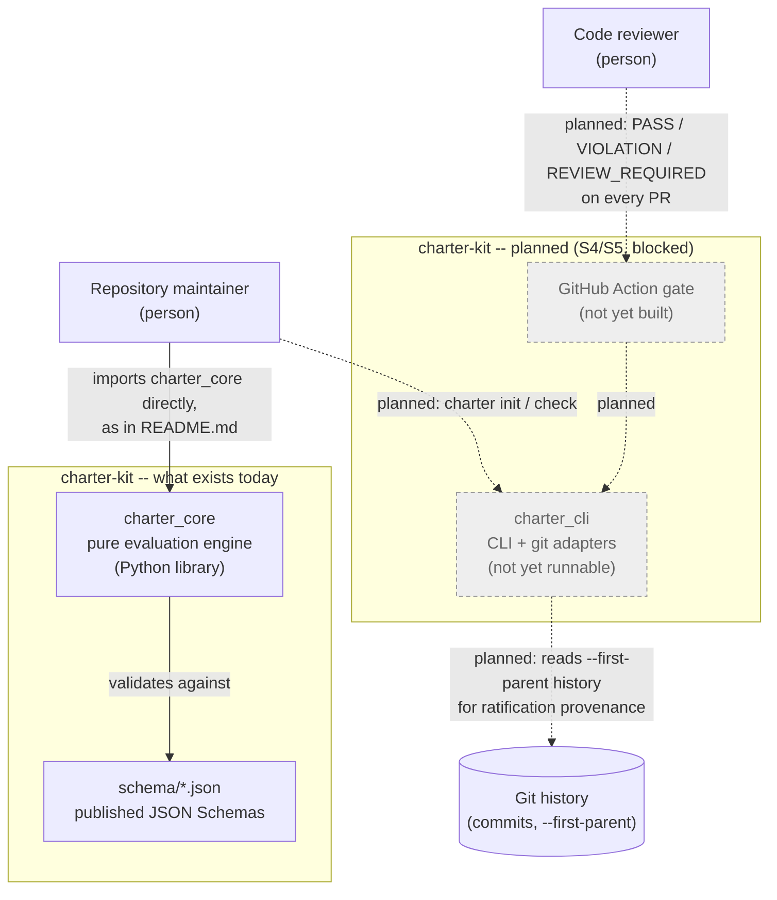
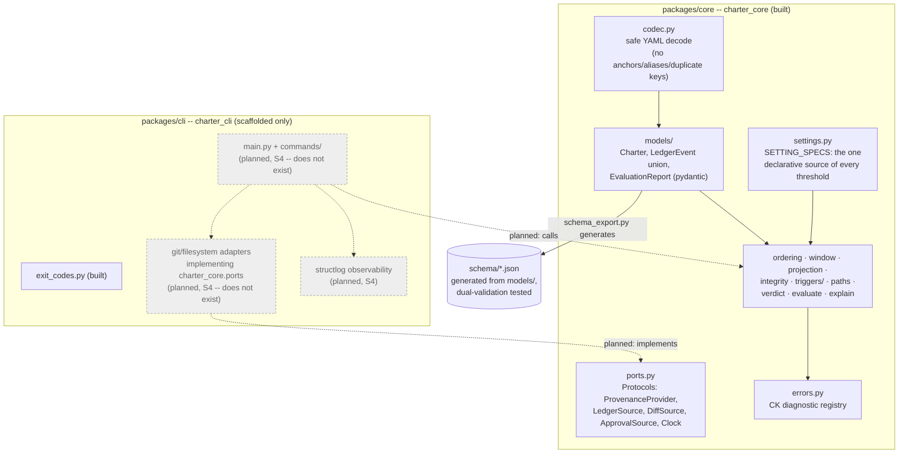
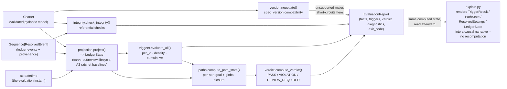
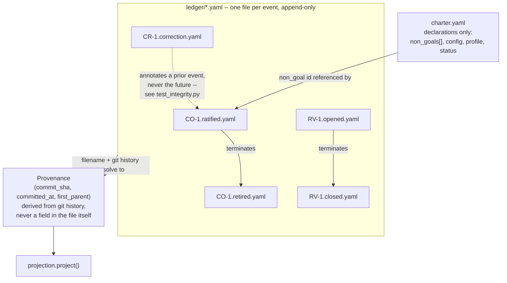

# Architecture

C4-style diagrams of the system as it actually exists today — not the
aspirational end state. Where a box represents something not yet built, it's
labeled "planned" and grayed out; nothing here pretends S4 has already
happened. See `NEXTSTEPS.md` for what's blocked and why.

Diagrams use plain Mermaid flowcharts rather than Mermaid's native
`C4Context`/`C4Container` diagram types, since GitHub's renderer support for
those lags behind Mermaid's own releases — a flowchart styled into C4's
levels renders reliably everywhere a flowchart does.

## Level 1 — System context

Who and what interacts with charter-kit, and how — today, that's a
developer with the Python library directly, since there is no CLI yet.

## Level 2 — Containers

The two packages in the `uv` workspace, and what's actually implemented in
each.

**The one hard rule this diagram exists to make visible:** nothing in
`packages/core` imports anything from `packages/cli`, and nothing in
`charter_core` performs I/O. Both are enforced structurally --
`.importlinter` fails the build on the first, an AST scan in
`tests/architecture/test_core_purity.py` fails it on the second. This isn't
a convention documented and hoped for; it's a compile-time-equivalent gate.

## Level 3 — Components: the evaluation pipeline

What actually happens inside `evaluate()`, the single function every future
surface (CLI, Action, MCP server) will call and the one that exists and is
tested today.

Every arrow in this diagram corresponds to a real function call you can find
in `packages/core/src/charter_core/evaluate.py`; nothing here is aspirational.

## Data model: the ledger

Nothing about a carve-out's or review's status is stored in the ledger
itself: `active`/`retired`/`expired`/`moot`, and every count and baseline,
are derived fresh by `projection.py` at evaluation time. See the module
docstrings in `packages/core/src/charter_core/projection.py` and
`packages/core/src/charter_core/models/state.py` for why -- an append-only
ledger with derived-not-stored status is what lets a status change without
rewriting history.
